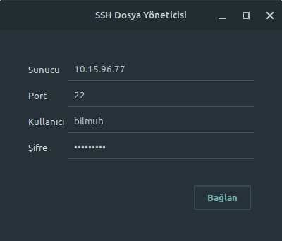
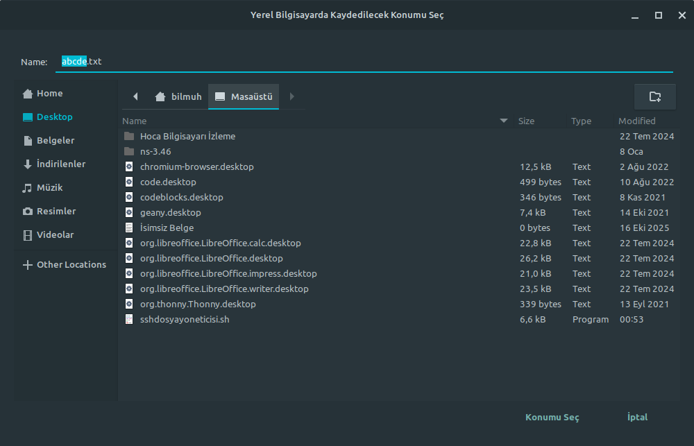
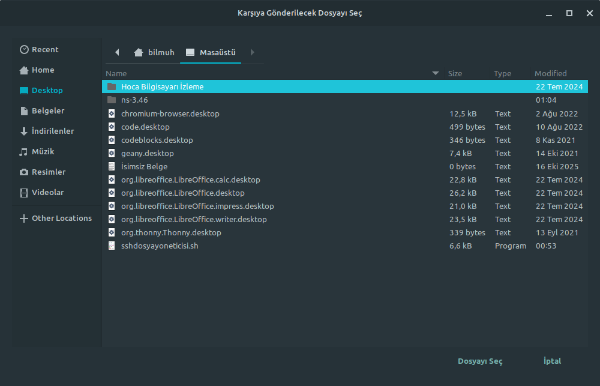
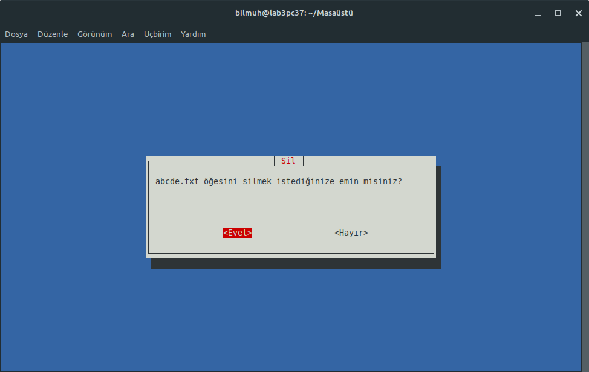
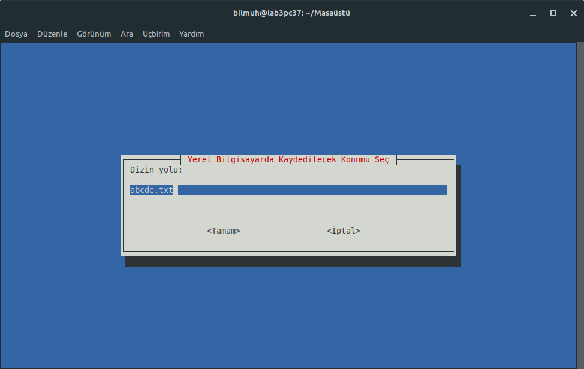

# Linux Araçları ve Kabuk Programlama SSH Dosya Yöneticisi Projesi

GUI modunda bağlantı bilgilerini girme

GUI modunda dizinlerde gezinme

GUI modunda dosya görüntüleme

GUI modunda yeniden adlandırma

GUI modunda silme

GUI modunda yerel bilgisayara aktarma

GUI modunda karşıya dosya gönderme

TUI modunda bağlantı bilgilerini girme

TUI modunda dizinlerde gezinme

TUI modunda yapılacak işlemi seçme

TUI modunda dosya görüntüleme

TUI modunda yeniden adlandırma

TUI modunda silme

TUI modunda yerel bilgisayara aktarma

TUI modunda karşıya dosya gönderme
